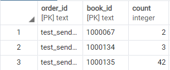
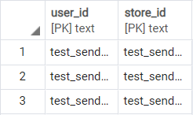

# 数据管理系统作业——Bookstore实验报告

| 课程名称：数据管理系统 | 项目名称：bookstore   | 指导老师：周烜 |
| ---------------------- | --------------------- | -------------- |
| **姓名：汤琼**         | **学号：10182100106** | **年级：2018** |
| **姓名：郑佳辰**       | **学号：**            | **年级：2018** |
| **姓名：孙秋实**       | **学号：10185501402** | **年级：2018** |

[TOC]


## 一. 实验要求

实现一个提供网上购书功能的网站后端。
网站支持书商在上面开商店，购买者可能通过网站购买。
买家和卖家都可以注册自己的账号。
一个卖家可以开一个或多个网上商店， 买家可以为自已的账户充值，在任意商店购买图书。
支持下单->付款->发货->收货，流程。

1.实现对应接口的功能，见doc下面的.md文件描述 （60%分数）

其中包括：

1)用户权限接口，如注册、登录、登出、注销

2)买家用户接口，如充值、下单、付款

3)卖家用户接口，如创建店铺、填加书籍信息及描述、增加库存
通过对应的功能测试，所有test case都pass
测试下单及付款两个接口的性能（最好分离负载生成和后端），测出支持的每分钟交易数，延迟等

2.为项目添加其它功能 ：（40%分数）

1)实现后续的流程
发货 -> 收货

2)搜索图书
用户可以通过关键字搜索，参数化的搜索方式； 如搜索范围包括，题目，标签，目录，内容；全站搜索或是当前店铺搜索。 如果显示结果较大，需要分页 (使用全文索引优化查找)

3)订单状态，订单查询和取消定单
用户可以查自已的历史订单，用户也可以取消订单。
取消定单（可选项，加分 +5~10），买家主动地取消定单，如果买家下单经过一段时间超时后，如果买家未付款，定单也会自动取消。

## 二 .项目运行

数据库初始化 （数据库已初始化完成，可直接运行下一步）//这边要改

```python
python init.py
```

运行

```python
python app.py
```

访问网址 http://localhost:10086/


## 三.数据库设计

### 3.1 总体设计思路

主要的实体类有：用户，订单，书店，书籍。

用户的主要操作有：

1. 查询
2. 下订单


### 3.2 ER图


### 3.3 关系模式


#### 3.3.1 invert_index table

* **设计思路**


* **表格结构**


#### 3.3.2 new_order table

* **设计思路**


* **表格结构**


#### 3.3.3 new_order_detail_table

* **设计思路**


* **表格结构**




#### 3.3.4 store table

* **设计思路**


* **表格结构**


#### 3.3.5 user_store table

* **设计思路**


* **表格结构**



#### 3.3.6 users table

* **设计思路**


* **表格结构**


### 3.4 关系模式优化

#### 3.4.1 表的分裂和合并


#### 3.4.2 冗余属性引入


#### 3.4.3 属性 or 成表


#### 3.4.4 范式规则


#### 3.4.5 索引创建


## 四.功能函数

### 4.1 用户权限功能

#### 4.1.1 注册

* 功能实现

  1. 根据 user_id 在 users 表中查询用户是否已经存在
  2. 若不存在，则插入新用户 (user_id, password, balance, token, terminal) 到 users 表中

* 性能分析

  一次查询users table，一次插入users table，**访问数据库两次**

#### 4.1.2 登录

* 功能实现

  1. 根据 user_id 在 users 表中获取密码password
  2. 将获取到的 password 与用户输入的密码对比
  3. 更新用户的 token, terminal

* 性能分析

  一次查询 users table, 一次更新 users table，**访问数据库两次**

#### 4.1.3 登出

* 功能实现

  1. 根据 user_id 在 users table 中查询，判断登录信息是否失效
  2. 更新用户 token

* 性能分析

  一次查询 users table，一次更新 users table，**访问数据库两次**

#### 4.1.4 注销

* 功能实现

  1. 根据 user_id 在 users table 中查询该用户是否存在
  2. 删除 users table中该用户条目

* 性能分析

  一次查询 users table, 一次更新 users table ，**访问数据库两次**

#### 4.1.5 更改密码

* 功能实现

  1. 根据 user_id 在 users table 中查询用户原先密码
  2. 判断用户原先密码和用户新密码是否相同
  3. 若不同，则更新 users table 中该用户的 password

* 性能分析

  一次查询 users table, 一次更新 users table，**访问两次数据库**

### 4.2 卖家功能

#### 4.2.1 创建店铺

* 功能实现

  1. 分别在 users table 和 store table 中查询 users_id 和 store_id 是否已经存在
  2. 若不存在，插入用户 user_id 和 store_id 到 user_store table

* 性能分析

  一次查询 users table, 一次查询 store table，一次插入 user_store table，**访问数据库三次**

#### 4.2.2 上架图书  //倒排表写详细点

* 功能实现

  1. 检查 user_id，store_id，book_id 是否存在
  2. 根据 book_id 在 Mongodb 的 book  collection 中查询 book 是否存在 
  3. 根据 book_json_str 分离出 作者名，作者国籍，书籍关键词，书的标题，书的作者等，插入倒排表 invert_index table
  4. 将 (store_id, book_id, stock_level, price) 插入 store table

* 性能分析

  一次查询 users table, 一次查询 user_store table, 一次查询 store table，一次查询 Mongodb 的book collection，一次插入 store table，插入 invert_index table 若干次 ，**至少访问数据库五次**

#### 4.2.3 添加库存

* 功能实现

  1. 检查 user_id, store_id,book_id 是否存在
  2. 根据 store_id,book_id 寻找该店家某本书的库存，并在 store table 中更新

* 性能分析

  一次查询 users table, 一次查询 user_store table, 一次查询 store table，一次更新 store table，**访问数据库四次**

#### 4.2.4 卖家发货

* 功能实现

  1. 检查 store_id,book_id 是否存在 
  2. 根据 order_id 在 new_order table 中更新订单状态

* 性能分析

  一次查询 user_store table, 一次查询 store table，一次更新 new_order table，**访问数据库三次**


### 4.3 买家功能

#### 4.3.1 充值

* 功能实现

  1. 根据  user_id 获取用户密码
  2. 将用户密码与用户输入的密码做对比
  3. 若密码一致，则更新该用户在 users table 中的余额

* 性能分析

  一次查询 users table，一次更新 users table，**访问数据库两次**

#### 4.3.2 下单

* 功能实现

  1. 检查 user_id, store_id 是否存在
  2. 根据订单信息（store_id，book_id）在 store 表中查找商户中是否存在对应书籍和足够的库存。
  3. 若库存足够，则更新 store table 库存
  4. 创建新订单信息，将 (order_id, book_id, count, price) 插入 new_order_detail table
  5. 创建该笔订单，计算该笔订单总价 total_price，将 (order_id, store_id, user_id, total_price, order_time) 插入 new_order table，同时将订单号 order_id 添加到 unpaid_order 数组

* 性能分析

  一次查询 users table, 一次查询 user_store table，一次查询 store table,  一次更新 store table，一次插入 new_order_detail table， 一次插入  new_order table，**访问数据库六次**

#### 4.3.3 付款

* 功能实现

  1. 根据 order_id 在 new_order table 中查询订单信息
  2. 查询订单是否超时
  3. 若订单未超时，则根据 buyer_id 在 users table 中获取买家余额和密码
  4. 根据 store_id 在 user_store table 中查询卖家 seller_id
  5. 在 users table 中更新买家的余额
  6. 在 new_order table 中更新订单状态 status=2

* 性能分析

  一次查询 new_order table, 一次查询 users table, 一次查询 user_store table, 

#### 4.3.4 买家收货


#### 4.3.5 查询当前订单


#### 4.3.6 查询历史订单


#### 4.3.7 手动取消订单


#### 4.3.8 自动取消订单

自动取消订单运用了一种“软实时”的思想

* 功能实现

  1. 维护一个全局列表，用来记录每个订单的起始时间（下单时间）
  2. 使用datetime等时间工具记录用户下单时的时间，存储于全局列表
  3. 利用Apscheduler调度器，实现每30分钟检查一次全局列表中订单的状态
  4. 若订单未超时，不做出任何动作，若被检查到超时，取消这笔订单。在用户下单时，会再次确认支付时间。

* 性能分析

  这是一种类似“软实时”的订单状态维护方法，可以将超时取消功能的开销降低很多。不专门起一个线程“盯着”用户的订单，而是每一个周期检查一次，取消掉被检查到超时的订单。在用户下单时，会再次检查是否超时，若超时则直接取消这笔订单。

#### 4.3.9 搜索


## 五. 版本控制

#### 活跃branch: improve


#### 活跃branch: modification


## 六. 测试

### 6.1 利用pytest和coverage测试和评估代码

本项目覆盖率在90%左右

* #### coverage test 代码覆盖率评估


### 6.2 测试接口&样例

#### 测试结果

基础测试35个全部通过，除此之外，我们为进阶功能编写了35个测试，也全部通过


#### 6.2.1 

接口


测试样例

| 测试情况 | 传参 username | 结果 message |
| -------- | ------------- | ------------ |
|          |               |              |
|          |               |              |
|          |               |              |
|          |               |              |


## 七. 实验结论

1. 关系数据库（Relational Database）是建立在关系模型基础上的数据库，支持的 **ACID 特性**，也就是原子性（Atomicity）、一致性（Consistency）、隔离性（Isolation）和持久性（Durability），且关系型数据库一般遵循三范式设计思想。而文档数据库提供了高效的读/写性能以及可自动容灾的数据库集群，还有灵活的数据库结构。两种不同的数据库为开发提供不同可能性，是一种互补的关系，可供开发者在不同的业务场景下选择相对应的数据库类型。
2. 这次数据库实验需要设计数据库并实现游戏功能，在关系型数据库设计时先做出ER图，再从ER图衍生出关系模式；然后对关系模式进行优化，引入索引等提高数据库性能，同时要注意适当保留冗余属性的来降低程序复杂度。
3. 通过此次作业，明白了关系型数据库的设计方法以及总体设计的重要性，不然后期的一个小改动，可能导致全盘推翻重来。在关系数据库设计中，我们首先要明确设计的最终目标，再根据目标决定哪些数据要持久化存储; 对于这些数据，要按照功能和逻辑来进行拆分，并且存放在不同的表中，并且明确之间的关系; 对于设计好的表，要进行重构，根据设计范式对大表进行拆分和优化; 对于每个表要增加对应的完整性检查，关键是实体完整性和参照完整性；最后在实际使用中，对于高频查询的记录构建索引提升效率，以及其他优化。
4. 熟悉了ORM操作和Flask框架的使用，以及如何利用pytest框架测试自己的代码，明白了web对函数接口访问的方式以及代码覆盖率，在此过程中遇到了许多问题，在此非常感谢助教耐心的解答和帮助，这次实验让我着实受益匪浅。